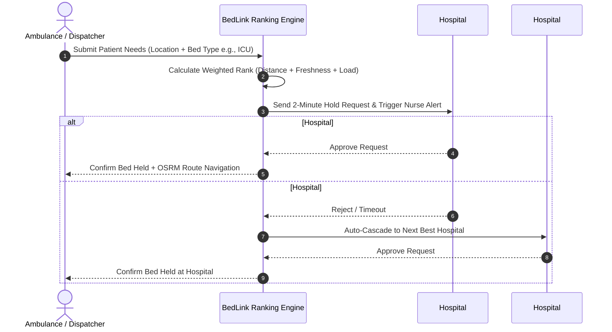
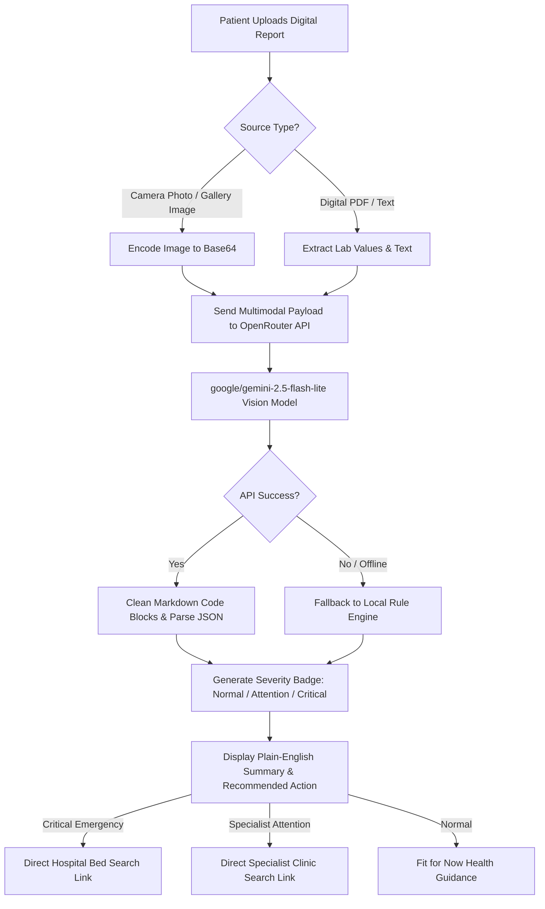

# 🏥 BedLink — Emergency Healthcare, Hospital Bed Allocation & AI Diagnostics

[](https://flutter.dev)
[](https://dart.dev)
[](https://riverpod.dev)
[](https://openrouter.ai)
[](#)

> **BedLink** is an end-to-end smart emergency healthtech platform built to bridge emergency medical dispatches, real-time hospital bed availability, clinic & pathology lab discovery, and AI-driven medical report analysis.

---

## 📌 Table of Contents
- [Project Overview](#-project-overview)
- [Key Features](#-key-features)
- [Technology Stack](#-technology-stack)
- [System Architecture & Workflow](#-system-architecture--workflow)
- [Dataset & API Information](#-dataset--api-information)
- [Setup & Installation Instructions](#-setup--installation-instructions)
- [Screenshots & Demo Information](#-screenshots--demo-information)
- [Limitations & Future Scope](#-limitations--future-scope)
- [Team Members](#-team-members)

---

## 🚀 Project Overview

In critical medical emergencies, finding an available hospital bed with the right equipment (**ICU, Ventilator, Oxygen, Cardiac, Burns**) within minutes can mean the difference between life and death. Traditional telephone queries cause costly delays, stale bed data, and ambulance rerouting.

**BedLink** resolves this challenge with three interconnected modules:
1. **Emergency Hospital Bed Ranking & 2-Minute Hold System**: Uses real-time weighted algorithms to match patients with the nearest hospital based on specialty beds, travel time, data freshness, and capacity load. Includes an automated 2-minute bed hold with auto-cascade on rejection.
2. **10-Second Hospital Nurse Dashboard**: Allows nurses to update bed availability in one tap with minute-level freshness timestamps.
3. **Patient Healthcare Hub & AI Test Report Analyzer**: Empowers patients to search for emergency hospital beds or specialist clinics/pathology labs, and upload digital medical test reports (PDFs, images, or camera photos) for instant plain-English AI analysis powered by OpenRouter API (`google/gemini-2.5-flash-lite`).

---

## 🌟 Key Features

### 🚑 1. Ambulance Dispatcher & Emergency Bed Ranking
- **Weighted Match Algorithm**: Ranks hospitals using a dynamic scoring formula factoring in distance, estimated driving time (OSRM API), bed type availability, capacity load penalty, and data freshness (staleness penalties for un-updated data).
- **2-Minute Bed Hold Protocol**: Upon requesting a bed, a 2-minute countdown timer holds the bed exclusively for the ambulance.
- **Auto-Cascade Fallback**: If a hospital rejects or times out, the system automatically redirects the request to the next highest-ranked hospital.
- **Live Turn-by-Turn Map Navigation**: Displays real-time ambulance routing to the destination hospital using Leaflet/OSRM maps.

### 🩺 2. Hospital Nurse 10-Second Dashboard
- **1-Tap Inventory Updates**: Nurses can update ICU, Ventilator, Oxygen, Cardiac, Burns, and General bed counts in under 10 seconds.
- **Data Freshness Tracker**: Displays live minutes since last update (e.g., "Updated 2m ago" vs. "Stale - Updated 55m ago").
- **Real-Time Request Alerts**: Audio & vibration alerts notify nurses of incoming emergency bed requests with approve/reject actions.
- **Request Audit History**: Tracks past approved, rejected, and timed-out requests.

### 🏥 3. Patient Healthcare Hub & Specialty Clinic Search
- **Dual Emergency Search Options**:
  - 🚑 **Emergency Hospital Beds**: Direct access to real-time ICU/Ventilator bed rankings.
  - 🔬 **Clinics & Pathology Labs**: Specialty filtering for non-emergency healthcare needs.
- **Multi-Specialty Filters**: Filter clinics by Dermatology (Skin), Pathology & Lab Tests, Gynecology, Dental, Pediatrics, Orthopedics, or General Physician.
- **Clinic Ranking Engine**: Ranks clinics by proximity, user rating, and consultation fees.

### 🧠 4. AI Digital Medical Test Report Analyzer
- **Multimodal Document Upload**: Pick digital PDFs, device gallery image scans, camera photos of paper reports, or pre-loaded realistic sample reports.
- **OpenRouter AI Vision Pipeline**: Uses OpenRouter API (`google/gemini-2.5-flash-lite`) to read complex lab report markers (e.g., Low Hemoglobin, High TSH, Low SPO2, Troponin I, Skin Biopsy Dermatitis).
- **Patient-Friendly Plain English**: Converts medical jargon into non-technical, simple explanations with bulleted key findings.
- **Smart Healthcare Recommendations**:
  - 🚨 **Critical Emergency**: Recommends immediate Hospital Admission (ICU/Cardiac Ward).
  - 🟡 **Requires Attention**: Recommends specialist Clinic / Diagnostic Lab consultation.
  - 🟢 **Normal**: Indicates *"You are fit for now!"* with preventive health tips.
- **Local Fallback Rule Engine**: Seamlessly falls back to an offline rule engine if network connection or API key is unavailable.

---

## 🛠️ Technology Stack

| Domain | Technology / Library | Description |
| :--- | :--- | :--- |
| **Framework** | Flutter (v3.13+) / Dart (v3.0+) | Cross-platform mobile & web client framework |
| **State Management** | Flutter Riverpod (`flutter_riverpod`) | Reactive state management & dependency injection |
| **Routing** | GoRouter (`go_router`) | Declarative type-safe routing |
| **AI LLM Engine** | OpenRouter API (`google/gemini-2.5-flash-lite`) | Multimodal vision & text medical analysis API |
| **Maps & Location** | `flutter_map`, `latlong2`, `geolocator` | OpenStreetMap rendering & device GPS location |
| **Routing API** | OSRM (Open Source Routing Machine) | Real-time driving distance & route geometry calculations |
| **Database / Sync** | Firebase Firestore (`cloud_firestore`, `firebase_core`) | Cloud data persistence & live updates |
| **Storage & Cache** | `shared_preferences` | Local state caching |
| **Media & Files** | `image_picker`, `file_picker` | Camera photo capture, gallery picking & PDF file handling |
| **UI & UX** | Material Design 3, Google Fonts (`google_fonts`), `intl` | Modern dark/light responsive interface & date formatting |
| **Feedback** | `audioplayers`, `vibration`, `url_launcher` | Audio sirens, vibration alerts, phone dialing |

---

## 🏗️ System Architecture & Workflow

```
BedLink System Architecture
├── lib/
│   ├── main.dart                  # Application entrypoint & theme config
│   ├── firebase_options.dart      # Firebase initialization
│   ├── core/
│   │   ├── constants.dart         # Global constants, API keys & bed types
│   │   ├── router.dart            # GoRouter navigation paths
│   │   └── theme.dart             # Material 3 color system & typography
│   ├── models/                    # Data models (Hospital, BedInventory, Clinic, TestReport, etc.)
│   ├── services/                  # Business logic & API services
│   │   ├── ranking_service.dart          # Hospital weighted bed ranking algorithm
│   │   ├── clinic_ranking_service.dart   # Clinic proximity & fee ranking
│   │   ├── openrouter_service.dart       # OpenRouter Gemini Multimodal API service
│   │   ├── report_analysis_service.dart  # Offline AI fallback analysis engine
│   │   ├── routing_service.dart          # OSRM driving distance & route fetching
│   │   └── firestore_service.dart        # Real-time Firestore bed sync
│   ├── providers/                 # Riverpod state providers
│   └── features/                  # Feature UI modules
│       ├── role_select/           # Role selection (Patient, Nurse, Ambulance)
│       ├── dispatch/              # Emergency bed search, ranking & routing
│       ├── nurse/                 # Nurse login, 10s bed updates & hold approvals
│       └── patient/               # Patient Hub, Clinic Finder & AI Test Report Analyzer
```

### 🔄 Emergency Dispatch & 2-Minute Bed Hold Workflow



### 🧠 AI Test Report Analysis Workflow



---

## 📊 Dataset & API Information

### 🌐 External APIs Used
1. **OpenRouter Multimodal Vision API**:
   - **Endpoint**: `https://openrouter.ai/api/v1/chat/completions`
   - **Model**: `google/gemini-2.5-flash-lite`
   - **Capabilities**: Translates medical lab report images and extracted text into plain-English patient summaries with JSON severity classification.
2. **OSRM (Open Source Routing Machine) API**:
   - **Endpoint**: `http://router.project-osrm.org/route/v1/driving`
   - **Capabilities**: Real-time road route geometry, driving distance in kilometers, and estimated time of arrival (ETA) in minutes.

### 🏢 Pre-seeded Local & Cloud Datasets
- **Hospitals Dataset**: Includes major emergency hospitals in the Mumbai Metropolitan Region (e.g., Lilavati Hospital, KEM Hospital, Nanavati Super Speciality, Kokilaben Dhirubhai Ambani Hospital, Fortis Hospital) with live bed inventory tracking (ICU, Ventilator, Oxygen, Cardiac, Burns, General).
- **Clinics & Pathology Labs Dataset**: Includes multi-specialty clinics and diagnostic labs (e.g., Metropolis Healthcare, Dr. Lal PathLabs, Apollo Clinic, Skin Care Dermatology Center, Fortis Pathology Lab) with specialty categorization, consultation fees, user ratings, and distance coordinates.
- **Medical Test Reports Sample Dataset**: Includes pre-formatted realistic sample reports (CBC Blood Count, Thyroid Profile, Emergency Cardiac Troponin, Dermatology Skin Biopsy, General Wellness Panel) for instant demonstration.

---

## 💻 Setup & Installation Instructions

### Prerequisites
- [Flutter SDK](https://docs.flutter.dev/get-started/install) (`>= 3.13.5`)
- [Dart SDK](https://dart.dev/get-started) (`>= 3.0.0`)
- Android Studio / VS Code with Flutter extension
- An Android/iOS Emulator or Physical Device

### 📥 Step-by-Step Installation

1. **Clone the Repository**:
   ```bash
   git clone https://github.com/your-username/bedlink.git
   cd bedlink
   ```

2. **Install Flutter Dependencies**:
   ```bash
   flutter pub get
   ```

3. **Configure OpenRouter API Key (Optional)**:
   The API key is pre-configured in `lib/core/constants.dart`. If you wish to use your own key:
   ```dart
   // lib/core/constants.dart
   static const String openRouterApiKey = 'YOUR_OPENROUTER_API_KEY';
   ```

4. **Run the Application**:
   ```bash
   # Run on connected device or emulator
   flutter run
   ```

5. **Run Code Analysis & Tests**:
   ```bash
   flutter analyze
   flutter test
   ```

---

## 📱 Screenshots & Demo Information

| Role / Feature | Screen | Highlights |
| :--- | :--- | :--- |
| **Role Selector** | Main Landing Page | Choose role between **Patient Healthcare Hub**, **Hospital Nurse**, or **Ambulance Dispatcher**. |
| **Patient Hub** | `patient_hub_screen.dart` | Access Emergency Bed Search, Clinic Finder, or AI Test Report Analyzer. |
| **AI Report Analyzer** | `report_list_screen.dart` | Upload gallery scans, camera photos, or sample lab reports for AI processing. |
| **Report Analysis Result** | `report_analysis_screen.dart` | View risk severity badges, plain-English summary, key findings, and action buttons. |
| **Clinics & Pathology Search**| `clinic_search_screen.dart` | Filter by specialty (Skin, Pathology, Gynecology, Dental, etc.) and view ranked clinics. |
| **Emergency Bed Dispatch** | `new_request_screen.dart` | Enter patient location and required bed type (ICU/Ventilator/Oxygen/Cardiac). |
| **Hospital Bed Ranking** | `results_screen.dart` | Ranked hospital list based on distance, data freshness, load, and ETA. |
| **Nurse Dashboard** | `bed_update_screen.dart` | 1-tap bed count updates with data freshness timestamps and incoming request alerts. |

---

## ⚠️ Limitations & Future Scope

### Limitations
- **API Rate Limits & Connectivity**: AI Vision analysis via OpenRouter relies on active internet access; if offline, the system seamlessly uses the local rule-based fallback engine.
- **OSRM Public Server Latency**: Public OSRM endpoints may occasionally introduce minor network latency during routing geometry requests.

### 🔮 Future Scope
- **IoT Ambulance Telemetry**: Real-time streaming of patient vital signs (ECG, SPO2, Blood Pressure) directly from ambulance equipment to receiving hospital ICUs.
- **Firebase Cloud Messaging (FCM)**: Push notifications sent directly to nurse mobile devices even when the app is running in the background.
- **Hospital EHR Integration**: Direct synchronization with hospital Electronic Health Records (EHR) and HMS software via FHIR / HL7 APIs.
- **Multi-Language Support**: Support for regional Indian languages (Hindi, Marathi, Gujarati, Tamil, etc.) for non-English speaking patients.

---

## 👥 Team Members

BedLink was designed and developed by:

- **Harsh Thakur**
- **Akash Thakur**
- **Saurabh Vaishya**
- **Viraj Bhagat**

---

<p align="center">
  <b>BedLink</b> — <i>Saving Lives by Connecting Ambulances, Beds, and Patients in Real-Time.</i>
</p>
# T20-BedLink
